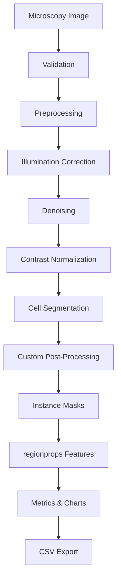

# MicroscopyAI

**Brightfield Cell Analysis & Quantification**

A computer vision pipeline that transforms raw microscopy images into validated, quantitative cell-level measurements. Built for portfolio demonstration of microscopy imaging, segmentation, and morphological quantification workflows.

## Overview

MicroscopyAI is a full-stack scientific workstation for brightfield microscopy analysis:

- Upload microscopy images (PNG, JPG, TIFF)
- Preprocess with illumination correction, denoising, and contrast normalization
- Segment cells using **Cellpose** (with classical watershed fallback when Cellpose is unavailable)
- Apply custom morphological post-processing
- Extract quantitative features via `skimage.measure.regionprops`
- Visualize overlays, labels, and distributions
- Export CSV and annotated images

The React frontend is **Vercel-ready** with **demo mode** for deployments where the heavy Python inference backend is not available.

## Problem

Brightfield microscopy images contain uneven illumination, noise, touching cells, and variable contrast. Manual counting and measurement are slow and inconsistent. This project automates:

```text
Microscopy Image → Preprocessing → Segmentation → Post-processing → Morphology → Export
```

## Features

- Brightfield / fluorescence image support
- OpenCV + scikit-image preprocessing pipeline
- Cellpose segmentation (extensible model abstraction)
- Custom post-processing (area filters, border removal, hole filling, morphology)
- Morphological feature extraction (area, perimeter, circularity, eccentricity, intensity)
- Scientific workstation UI (React + Vite, JavaScript only)
- Demo mode with bundled precomputed legitimate analysis
- CSV export and annotated image download
- Time-lapse architecture (tracking module scaffold)

## Pipeline



## Architecture

```text
React + Vite frontend (Vercel)
        ↓  VITE_API_URL
Python FastAPI API
        ↓
Pipeline: preprocessing → segmentation → postprocessing → features
        ↓
Cellpose / watershed fallback
```

## Computer Vision Methods

| Stage | Methods |
| --- | --- |
| Illumination | Background subtraction, morphological opening, white top-hat |
| Denoising | Gaussian, median, non-local means |
| Contrast | Adaptive histogram equalization |
| Segmentation | Cellpose (cyto/cyto2/nuclei) or watershed fallback |
| Post-processing | Area filtering, border clearing, hole filling, opening/closing |
| Features | Connected components, `regionprops`, circularity \(4\pi A / P^2\) |

## Why Cellpose?

Training a new segmentation network requires labeled microscopy data, GPU time, and domain-specific tuning. Cellpose provides strong pretrained models for cellular images. This project focuses engineering contribution on:

- Preprocessing for uneven illumination
- Custom post-processing beyond raw model output
- Morphological quantification and export
- Production-oriented API + UI architecture

U-Net and StarDist backends are scaffolded for future extension.

## Dataset

The repository includes a **small synthetic brightfield sample** (`frontend/public/samples/sample_cells.png`) and precomputed demo results.

For full evaluation, recommended public datasets (not redistributed here):

- **LIVECell** — brightfield cell segmentation benchmarks
- **BBBC** — Broad Bioimage Benchmark Collection
- **Cell Tracking Challenge** — time-lapse tracking

Download datasets from their official hosts and respect license terms.

## Evaluation

Formal benchmark metrics (Dice, IoU, precision, recall) are **TODO** — not yet run against LIVECell ground truth. Processing time is reported per analysis request from the live API.

## Failure Cases

- Touching cells may merge in watershed fallback mode
- Uneven illumination without correction degrades segmentation
- Low-contrast regions may yield empty masks
- Cellpose not installed → watershed fallback (labeled in API response)
- Oversized uploads rejected (50 MB limit)

## Quick Start

### Frontend

```bash
cd frontend
npm install
cp ../.env.example ../.env
npm run dev
```

Open http://localhost:5173

### Backend

```bash
python -m venv .venv
source .venv/bin/activate
pip install -r backend/requirements.txt
# Optional for Cellpose inference:
# pip install cellpose torch

export PYTHONPATH=$(pwd)
uvicorn backend.main:app --reload --port 8000
```

### Environment variables

```text
VITE_API_URL=http://localhost:8000
VITE_DEMO_MODE=true
```

When `VITE_DEMO_MODE=true`, the UI loads bundled **DEMO DATA** if the backend is unavailable. Demo results are clearly labeled and are not presented as live inference.

## Deployment

### Vercel (frontend)

- Root `vercel.json` builds `frontend/` and serves SPA
- Set `VITE_API_URL` to your deployed Python API
- Set `VITE_DEMO_MODE=true` for standalone UI demos

### Python API

Deploy FastAPI on any Python-compatible host (Railway, Fly.io, EC2, etc.). Heavy Cellpose/PyTorch inference is **not** assumed to run in Vercel serverless functions.

## Development

```bash
# Tests
PYTHONPATH=. pytest

# Frontend build
cd frontend && npm run build
```

## License

MIT — see [LICENSE](LICENSE).
